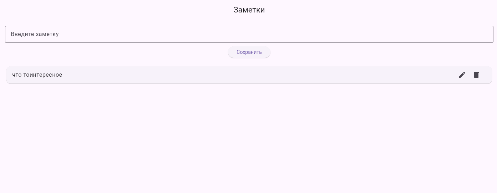
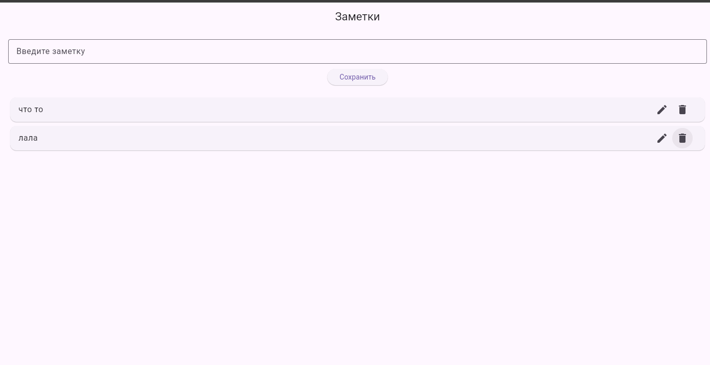
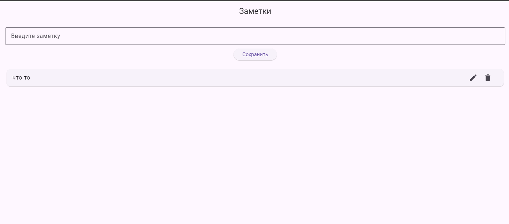
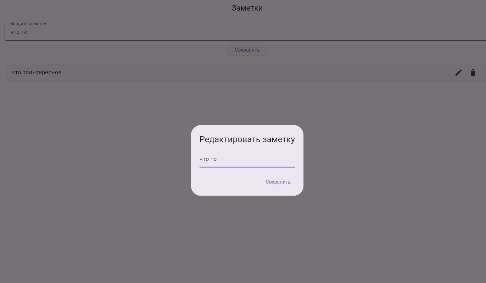
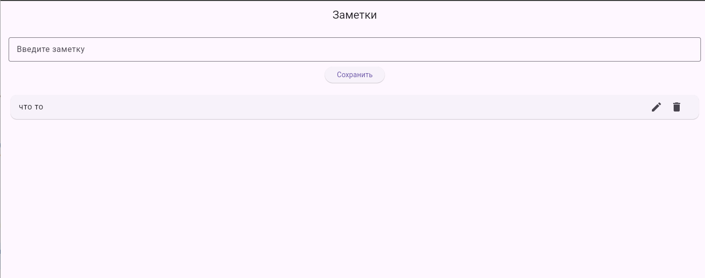

# practos1 — Flutter Notes App

Простое мобильное приложение **«Заметки»**, написанное на **Flutter**.  
Проект выполнен в рамках практической работы по теме:

> **Работа с текстом в Flutter: TextEditingController и ListView**

---
### Главный экран


### Удаление заметки



### Редактирование заметки




## 📱 Описание приложения

Приложение позволяет:
- вводить текст заметки
- сохранять заметки
- отображать их в виде списка
- редактировать существующие заметки
- удалять заметки

---

## ✅ Реализованный функционал

### На оценку 4
- Поле ввода текста (`TextField`)
- Кнопка **«Сохранить»**
- Отображение заметок с помощью `ListView.builder`

### На оценку 5
- Удаление заметок
- Редактирование заметок
- Использование `TextEditingController`
- Динамический список (`ListView.builder`)

---

## 🛠 Используемые технологии

- Flutter
- Dart
- Material UI
- TextEditingController
- ListView.builder

---

## 📂 Структура проекта

```text
practos1/
├── lib/
│   └── main.dart
├── android/
├── ios/
├── pubspec.yaml
└── README.md
